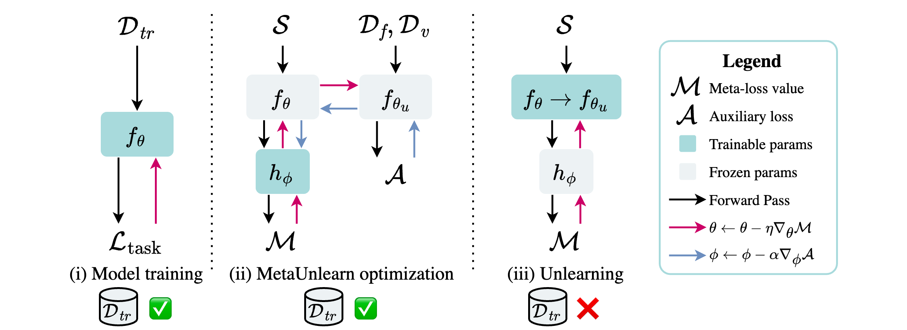

<h1 align="center">
Unlearning Personal Data from a Single Image</br>(TMLR 2025)
</h1>

<div align="center">

#### [Thomas De Min](https://scholar.google.com/citations?user=fnh_i0cAAAAJ&hl=en), [Massimiliano Mancini](https://scholar.google.com/citations?hl=it&authuser=1&user=bqTPA8kAAAAJ), [Stéphane Lathuilière](https://scholar.google.fr/citations?user=xllguWMAAAAJ&hl=fr), </br>[Subhankar Roy](https://scholar.google.it/citations?user=YfzgrDYAAAAJ&hl=en), and [Elisa Ricci](https://scholar.google.com/citations?user=xf1T870AAAAJ&hl=it&authuser=1)

[](https://arxiv.org/abs/2407.12069)

<p align="center">
   
</p>

</div>

> **Abstract.** 
*Machine unlearning aims to erase data from a model as if the latter never saw them during training. While existing approaches unlearn information from complete or partial access to the training data, this access can be limited over time due to privacy regulations. Currently, no setting or benchmark exists to probe the effectiveness of unlearning methods in such scenarios. To fill this gap, we propose a novel task we call One-Shot Unlearning of Personal Identities (1-SHUI) that evaluates unlearning models when the training data is not available. We focus on unlearning identity data, which is specifically relevant due to current regulations requiring personal data deletion after training. To cope with data absence, we expect users to provide a portraiting picture to aid unlearning. We design requests on CelebA, CelebA-HQ, and MUFAC with different unlearning set sizes to evaluate applicable methods in 1-SHUI. Moreover, we propose MetaUnlearn, an effective method that meta-learns to forget identities from a single image. Our findings indicate that existing approaches struggle when data availability is limited, especially when there is a dissimilarity between the provided samples and the training data.*

## Citation
```
@article{
  min2025unlearning,
  title={Unlearning Personal Data from a Single Image},
  author={Thomas De Min and Massimiliano Mancini and St{\'e}phane Lathuili{\`e}re and Subhankar Roy and Elisa Ricci},
  journal={Transactions on Machine Learning Research},
  issn={2835-8856},
  year={2025},
  url={https://openreview.net/forum?id=VxC4PZ71Ym},
  note={}
}
```

## Installation 
### Dependencies
We used Python 3.11.7 for all our experiments. Therefore, we suggest creating a conda environment as follows:
```bash
$ conda create -n oneshui python=3.11.7
```
and install pip requirements with:
```bash
$ pip install -r requirements.txt
```

### Datasets
Use `--data_dir path/to/datasets/` when running our scripts to set the dataset root.
Our code will look for datasets inside the provided directory, expecting each dataset to be structured as follows:
```
mufac/
    ├── test_images/
    ├── fixed_val_dataset/
    ├── val_images/
    ├── train_images/
    ├── fixed_test_dataset/
    ├── custom_val_dataset.csv
    ├── custom_train_dataset.csv
    └── custom_test_dataset.csv
celeba/
    ├── img_align_celeba/
    ├── list_bbox_celeba.txt
    ├── list_attr_celeba.txt
    ├── list_eval_partition.csv
    ├── identity_CelebA.txt
    ├── list_attr_celeba.csv
    ├── list_eval_partition.txt
    └── list_landmarks_align_celeba.txt
CelebAMask-HQ/
    ├── CelebA-HQ-img/
    ├── CelebAMask-HQ-attribute-anno.txt
    └── CelebA-HQ-identity.txt
```

> Note: We CelebA-HQ identity annotations can be downloaded [here](https://github.com/ndb796/CelebA-HQ-Face-Identity-and-Attributes-Recognition-PyTorch/tree/main).

## Run Experiments
Run each experiment using `python main.py` with different arguments. Run `python main.py --help` for the full list of available arguments. Below we report a couple of scenarios.

### Pretrain
Model pre-training on CelebA for 5 identities:
```bash
$ python main.py --method pretrain --dataset celeba --num_identities 5
```

### Retrain
Model retraining on CelebA-HQ for 20 identities:
```bash
$ python main.py --method retrain --dataset celebahq --num_identities 20
```

### MetaUnlearn
Train and eval MetaUnlearn on Mufac with 10 identities:
```bash
$ python main.py --method meta_unlearn --dataset mufac --num_identities 10
```

### Storing and Loading Checkpoints
Checkpoints are stored by default in `output/` while they are loaded by default from `checkpoints/`. We used this configuration to avoid overwriting "good" checkpoints. These two locations can be changed using the following arguments: `--store_dir path/to/checkpoints` and `--checkpoint_dir path/to/checkpoints`.

### Membership Inference Attack
We use one reference model to compute the RMIA attack. Let us assume that we want to target an unlearned model, pretrained and unlearned with a certain seed `--seed your_seed` (this is important as different seeds lead to different splits). To obtain the reference model, we copy the retrained model that has the same seed as the unlearned model to a new directory (e.g., `shadow_models/`), which must have the same structure as the checkpoint directory (i.e., `shadow_models/<dataset>/vit_base_patch16_224/`). We then change the name from `retrain_<num_ids>_<seed>.pth` to `pretrain_<num_ids>_<seed + x>.pth`, where `x` is an integer of choice. Finally, we run the unlearning algorithm by loading the checkpoint from the new directory and setting the seed to `seed + x`.
Here is an example on how to compute a reference model for `celebahq/vit_base_patch16_224/meta_unlearn_20_0.pth` (meta_unlearn on CelebA-HQ, 20 identities, seed 0):
```bash
$ mkdir -p shadow_models/
$ cp checkpoints/celebahq/vit_base_patch16_224/retrain_20_0.pth shadow_models/celebahq/vit_base_patch16_224/pretrain_20_1.pth # here we set the seed to 1 (0 + 1)
$ python main.py --method meta_unlearn --dataset celebahq --num_identities 20 --checkpoint_dir shadow_models/ --output_dir shadow_models/
```
This step will generate a model in which the forget set was never part of the training data while accounting for the noise introduced by the unlearning algorithm.

To compute the membership inference attack, it is sufficient to run `low_cost_mia.py`:
```bash
python low_cost_mia.py --dataset celebahq --num_identities 20
```

> Note: adjust shadow models dir, checkpoints dir, and target methods directly in `low_cost_mia.py`

## Acknowledgements
We acknowledge the CINECA award under the ISCRA initiative for the availability of high-performance computing resources and support. E.R. and M.M. are supported by the MUR PNRR project FAIR - Future AI Research (PE00000013), funded by NextGeneration EU. E.R. is also supported by the EU projects AI4TRUST (No.101070190) and ELIAS (No.01120237) and the PRIN project LEGO-AI (Prot.2020TA3K9N). T.D.M. is funded by NextGeneration EU. This work has been supported by the French National Research Agency (ANR) with the ANR-20-CE23-0027.

## Contacts
Please do not hesitate to file an issue or contact me at `thomas.demin@unitn.it` if you find errors or bugs or if you need further clarification. 
